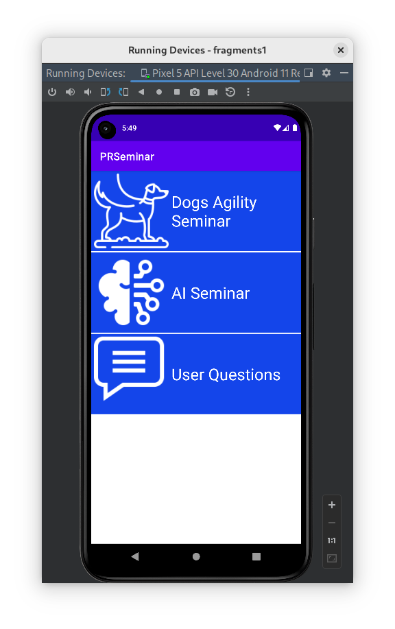

# CAT 2
Alejandro Pérez Bueno
Dec 13, 2023

-   [1. Login Screen](#login-screen)
    -   [a. `onViewCreated`](#a.-onviewcreated)
    -   [b. `setOnClickListener`](#b.-setonclicklistener)
    -   [c. `DataSourceHardcode`](#c.-datasourcehardcode)
-   [2. List of Seminars](#list-of-seminars)



## 1. Login Screen

### a. `onViewCreated`

The code sets up an observer to watch for changes in a login and perform
actions depending on the result of said login. If the result of the
login (`loginResult`) is null, nothing is done. Otherwise, the progress
bar is hidden and we check the status of the login result. If it has had
an error, a message is shown. If the login is successful, the UI is
updated with the user’s info, a message is shown saying “`Login OK`” and
the user’s id is updated with the `loginOK()` method to match the new
user’s id.

### b. `setOnClickListener`

The code here listens for when the `login` button is clicked, and sets
the progress bar to be visible, as well as attempts to log in with the
entered username and password. It is inside a Fragment class because it
allows the code inside to be more encpsulated and self-contained within
an app, separate from an activity.

### c. `DataSourceHardcode`

``` kotlin
user_harcoded = if (username == "user1@uoc.com") {
    User(1, "Jane Doe")
} else {
    User(2, "John Doe")
}
```

## 2. List of Seminars

> **Note**
>
> Answered in Project Folder


