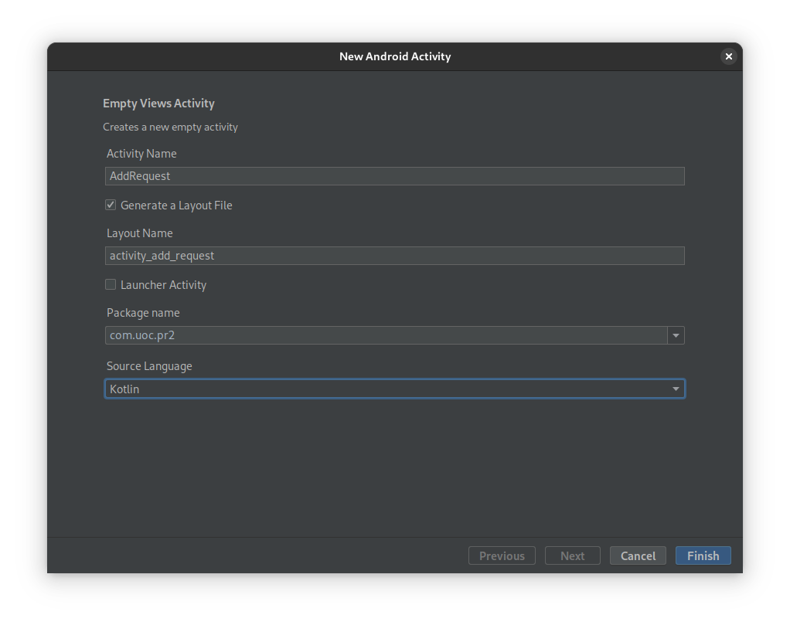
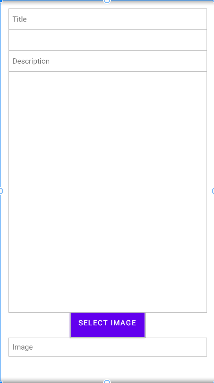

# CAT 3
Alejandro Pérez Bueno
Dec 13, 2023

-   [<span class="toc-section-number">1</span> Create the local
    database](#create-the-local-database)
    -   [<span class="toc-section-number">1.1</span>
        `CREATE SQL`](#create-sql)
    -   [<span class="toc-section-number">1.2</span>
        `command_list`](#command_list)
-   [<span class="toc-section-number">2</span> Local
    filesystem](#local-filesystem)
-   [<span class="toc-section-number">3</span> Implement the class
    DataSourceLocal](#implement-the-class-datasourcelocal)
    -   [<span class="toc-section-number">3.1</span>
        `str_sql`](#str_sql)
    -   [<span class="toc-section-number">3.2</span>
        `selectSeminarsUser`](#selectseminarsuser)
    -   [<span class="toc-section-number">3.3</span> `selectItems` part
        1](#selectitems-part-1)
    -   [<span class="toc-section-number">3.4</span> `selectItems` part
        2](#selectitems-part-2)
-   [<span class="toc-section-number">4</span> Use the class
    DataSourceLocal](#use-the-class-datasourcelocal)
-   [<span class="toc-section-number">5</span> Read files from the
    filesystem](#read-files-from-the-filesystem)
    -   [<span class="toc-section-number">5.1</span>
        `SeminarsAdapter`](#seminarsadapter)
    -   [<span class="toc-section-number">5.2</span>
        `ItemsAdapter`](#itemsadapter)
    -   [<span class="toc-section-number">5.3</span>
        `DetailFragment`](#detailfragment)
-   [<span class="toc-section-number">6</span> Create an activity
    AddRequest](#create-an-activity-addrequest)
    -   [<span class="toc-section-number">6.1</span> Activity
        Creation](#activity-creation)
    -   [<span class="toc-section-number">6.2</span> Activity
        Design](#activity-design)
-   [<span class="toc-section-number">7</span> Testing](#testing)
-   [<span class="toc-section-number">8</span> Annexes](#annexes)



## Create the local database

### `CREATE SQL`

The code to be added is the following:

``` kotlin
db.execSQL(SQL_CREATE_user)
db.execSQL(SQL_CREATE_seminar)
db.execSQL(SQL_CREATE_item)
db.execSQL(SQL_CREATE_request)
db.execSQL(SQL_CREATE_user_seminar)
```

> **Note**
>
> See
> [`DbHelper.kt`](./PR3/app/src/main/java/com/uoc/pr2/data/localstorage/DbHelper.kt)
> for more details

### `command_list`

``` kotlin
for (command in command_list) {
    db.execSQL(command)
}
```

> **Note**
>
> See
> [`DbHelper.kt`](./PR3/app/src/main/java/com/uoc/pr2/data/localstorage/DbHelper.kt)
> for more details

## Local filesystem

Here are the comments I added to the code:

``` kotlin
// Create the /media directory in the app's internal storage
// Create the /media/seminar directory in the app's internal storage
// Move three logos to the /media/seminar directory we just created
// Create the /media/item directory in the app's internal storage
// Move three dog images to the /media/item directory we just created
// Move three medicine images to the /media/item directory we just created
// Move three AI images to the /media/item directory we just created
// Create the /media/request directory in the app's internal storage
```

> **Note**
>
> See
> [`DbHelper.kt`](./PR3/app/src/main/java/com/uoc/pr2/data/localstorage/DbHelper.kt)
> for more details

## Implement the class DataSourceLocal

### `str_sql`

> **Note**
>
> See
> [`DataSourceLocal.kt`](./PR3/app/src/main/java/com/uoc/pr2/data/DataSourceLocal.kt)
> for more details

### `selectSeminarsUser`

Here is the code to be added to the code:

``` kotlin
val cursor = db.rawQuery(str_sql, null)
while (cursor.moveToNext()) {
    userSeminarList.add(Seminary(cursor.getInt(cursor.getColumnIndex("sem_id")),
        cursor.getString(cursor.getColumnIndex("sem_name")),
        cursor.getInt(cursor.getColumnIndex("sem_duration")),
        context.filesDir.path + "/media/seminar/" + 
                cursor.getInt(cursor.getColumnIndex("sem_id")) + ".jpg"))
cursor.close()
```

The code launches the query specified in `str_sql` and then iterates
over every result to create a seminary from each result.

> **Note**
>
> See
> [`DataSourceLocal.kt`](./PR3/app/src/main/java/com/uoc/pr2/data/DataSourceLocal.kt)
> for more details

### `selectItems` part 1

Here are the lines to be added to the code:

``` kotlin
while (cursor.moveToNext()) {
    seminarItemList.add(Item(ItemType.BASIC,
        cursor.getInt(cursor.getColumnIndex("item_id")),
        cursor.getString(cursor.getColumnIndex("item_title")),
        cursor.getString(cursor.getColumnIndex("item_description"))))
}
cursor.close()
```

> **Note**
>
> See
> [`DataSourceLocal.kt`](./PR3/app/src/main/java/com/uoc/pr2/data/DataSourceLocal.kt)
> for more details

### `selectItems` part 2

Here are the lines to be added to the code:

``` kotlin
val cursor = db.rawQuery(str_sql, null)
var UserRequestList = mutableListOf<UserRequest>()
while (cursor.moveToNext()) {
    UserRequestList.add(UserRequest(cursor.getLong(cursor.getColumnIndex("request_id")),
        cursor.getString(cursor.getColumnIndex("request_description"))))
}
cursor.close()
```

> **Note**
>
> See
> [`DataSourceLocal.kt`](./PR3/app/src/main/java/com/uoc/pr2/data/DataSourceLocal.kt)
> for more details

## Use the class DataSourceLocal

Here is how the code looks:

``` kotlin
val Default = DataSourceType.LocalStorage
```

> **Note**
>
> See
> [`DataSourceLocal.kt`](./PR3/app/src/main/java/com/uoc/pr2/data/DataSourceLocal.kt)
> for more details

## Read files from the filesystem

### `SeminarsAdapter`

Here are the lines to be added to the code:

``` kotlin
val imagePath = item.image_path
val bitmap = BitmapFactory.decodeFile(imagePath)
itemImageView.setImageBitmap(bitmap)
```

In this code, we use the `decodeFile()` to load the bitmap from the
filesystem using `imagePath` value as a parameter. We then assign the
loaded bitmap to `itemImageView` using `setImageBitmap()`.

> **Note**
>
> See
> [`SeminarsAdapter.kt`](./PR3/app/src/main/java/com/uoc/pr2/ui/listSeminars/SeminarsAdapter.kt)
> for more details

### `ItemsAdapter`

Here are the lines to be added to the code:

``` kotlin
val imagePath = item.image_path
val bitmap = BitmapFactory.decodeFile(imagePath)
itemImageView?.setImageBitmap(bitmap)
```

> **Note**
>
> See
> [`ItemsAdapter.kt`](./PR3/app/src/main/java/com/uoc/pr2/ui/list/ItemsAdapter.kt)
> for more details

### `DetailFragment`

Here are the lines to be added to the code:

``` kotlin
val imagePath = item?.image_path  
val bitmap = BitmapFactory.decodeFile(imagePath)  
v2.setImageBitmap(bitmap)
```

> **Note**
>
> See
> [`ItemsAdapter.kt`](./PR3/app/src/main/java/com/uoc/pr2/ui/list/ItemsAdapter.kt)
> for more details

## Create an activity AddRequest

### Activity Creation

> **Note**
>
> See [Figure 1](#fig-addrequest) to verify the parameters used in the
> creation of this activity

### Activity Design

Here is how the layout file looks:

``` xml
<?xml version="1.0" encoding="utf-8"?>  
<androidx.constraintlayout.widget.ConstraintLayout  
    xmlns:android="http://schemas.android.com/apk/res/android"  
    xmlns:app="http://schemas.android.com/apk/res-auto"  
    xmlns:tools="http://schemas.android.com/tools"  
    android:layout_width="match_parent"  
    android:layout_height="match_parent"  
    android:background="@color/gray">  
  
    <LinearLayout  
        android:layout_width="match_parent"  
        android:layout_height="match_parent"  
        android:orientation="vertical"  
        android:padding="16dp"  
        android:background="@drawable/purple_border">

        <TextView
            android:layout_width="match_parent"
            android:layout_height="40dp"
            android:gravity="center_vertical"
            android:padding="8dp"
            android:text="Title" />

        <EditText
            android:id="@+id/editTitle"
            android:layout_width="match_parent"
            android:layout_height="40dp"
            android:background="@color/white"
            android:gravity="center_vertical"
            android:padding="8dp" />

        <TextView
            android:layout_width="match_parent"
            android:layout_height="40dp"
            android:gravity="center_vertical"
            android:padding="8dp"
            android:text="Description" />

        <EditText
            android:id="@+id/editDescription"
            android:layout_width="match_parent"
            android:layout_height="460dp"
            android:background="@color/white"
            android:gravity="top|left"
            android:inputType="textMultiLine"
            android:padding="8dp" />

        <Button
            android:id="@+id/btnSelectImage"
            android:layout_width="wrap_content"
            android:layout_height="wrap_content"
            android:layout_gravity="center_horizontal"
            android:background="#673AB7"
            android:gravity="center_horizontal"
            android:text="SELECT IMAGE"
            android:textColor="@android:color/white" />

        <TextView
            android:layout_width="match_parent"
            android:layout_height="wrap_content"
            android:background="@color/white"
            android:gravity="center_vertical"
            android:padding="8dp"
            android:text="Image" />
  
    </LinearLayout>
</androidx.constraintlayout.widget.ConstraintLayout>
```

> **Note**
>
> See
> [`activity_add_request.xml`](./PR3/app/src/main/res/layout/activity_add_request.xml)
> for more details
>
> See [Figure 2](#fig-addrequest-ui) to see the result

## Testing

🚧

## Annexes




