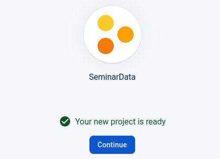
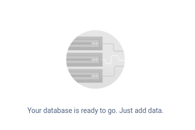
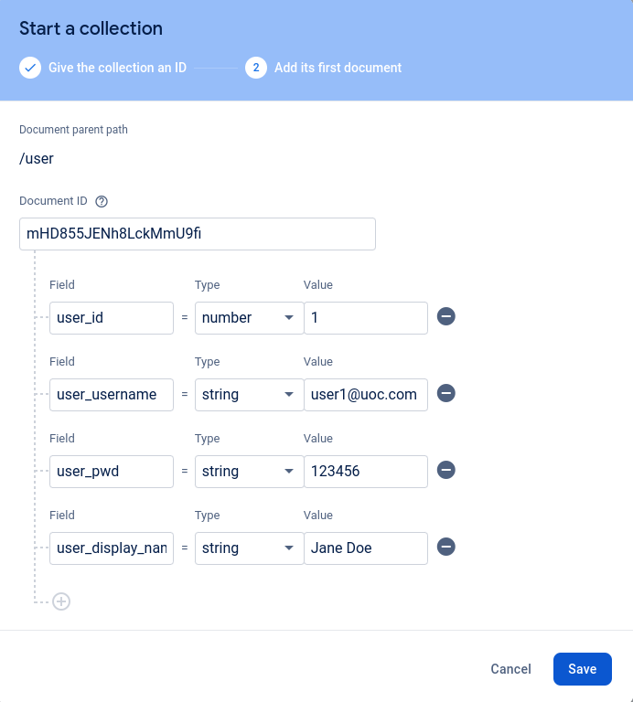
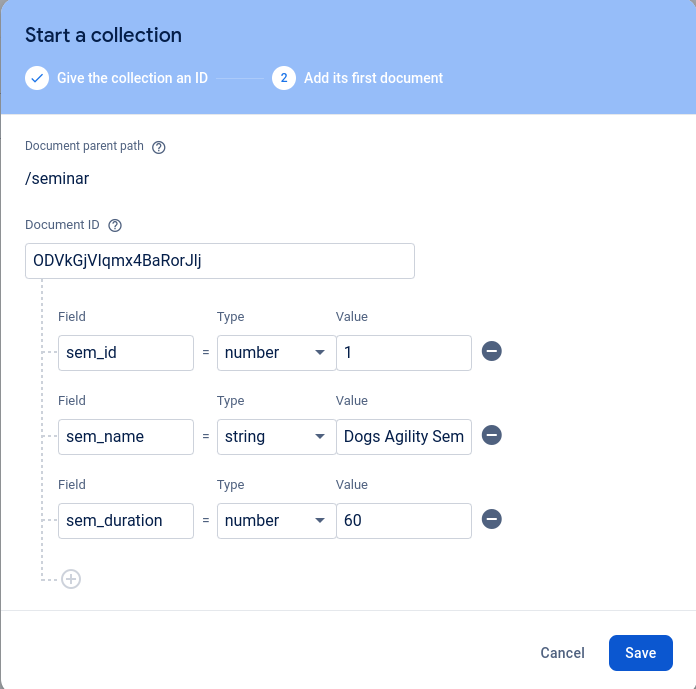
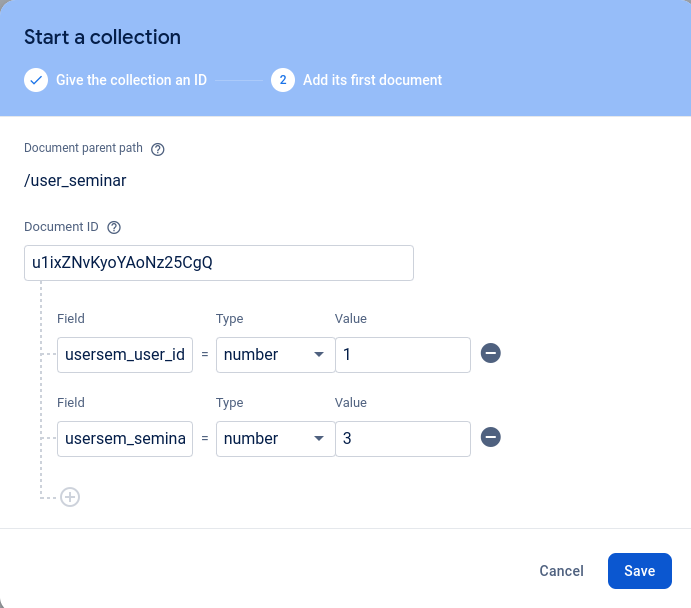
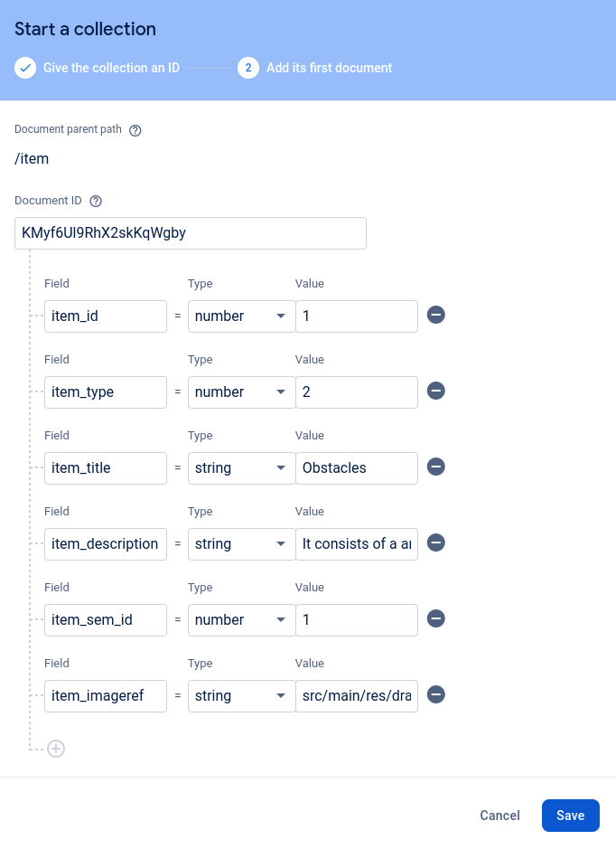
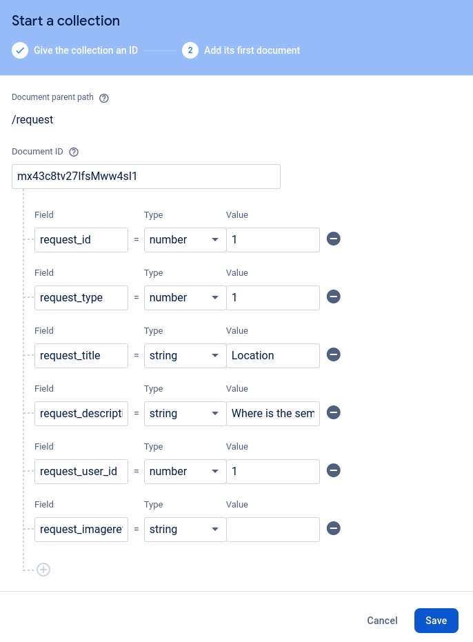
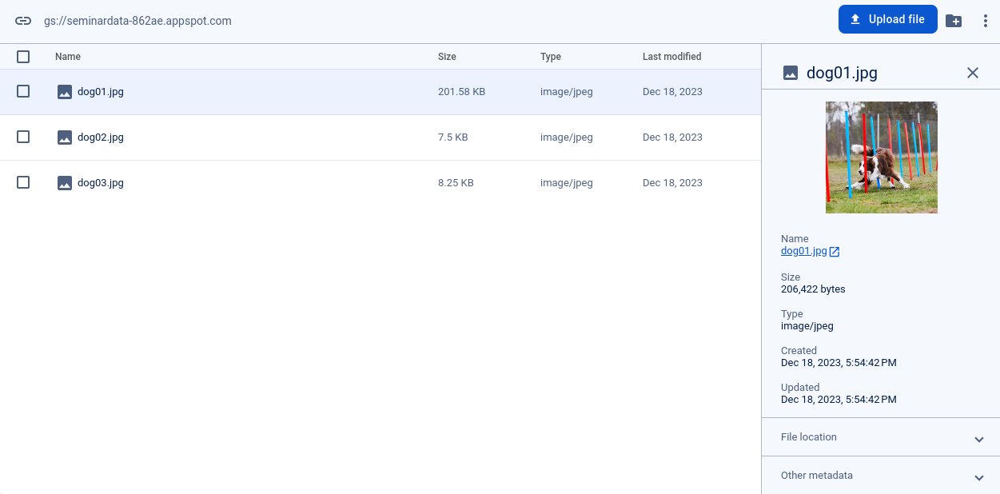
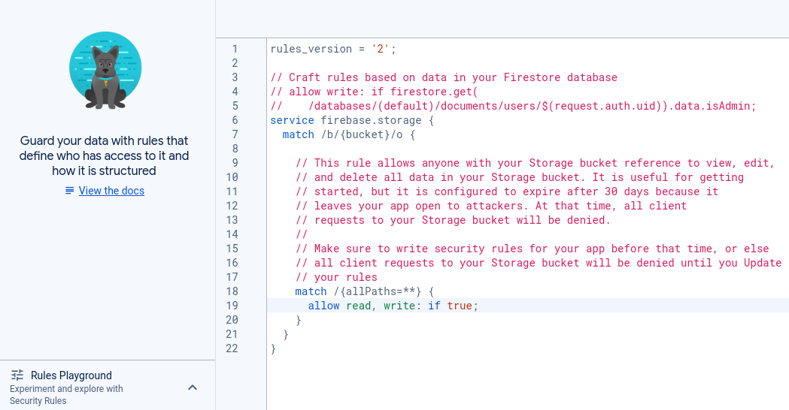
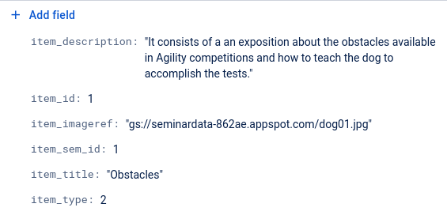

# CAT 4
Alejandro Pérez Bueno
Dec 18, 2023

-   [Firebase preparation](#firebase-preparation)
    -   [Add project](#add-project)
    -   [`user` collection](#user-collection)
    -   [`seminar` collection](#seminar-collection)
    -   [`user_seminar` collection](#user_seminar-collection)
    -   [`Add app` button](#add-app-button)
-   [Back-end programming](#back-end-programming)
    -   [Where is the data located, compared to previous CATs? Has data
        access become faster or
        slower?](#where-is-the-data-located-compared-to-previous-cats-has-data-access-become-faster-or-slower)
    -   [When method `loginAsync` ends, does it know at that time
        whether the login attempt is correct or
        not?](#when-method-loginasync-ends-does-it-know-at-that-time-whether-the-login-attempt-is-correct-or-not)
    -   [What is the role of listener that is passed as parameter to the
        `loginAsync`
        method?](#what-is-the-role-of-listener-that-is-passed-as-parameter-to-the-loginasync-method)
-   [Loading a user’s seminars](#loading-a-users-seminars)
    -   [`usersem_seminar_id`](#usersem_seminar_id)
    -   [create Seminary class
        instances](#create-seminary-class-instances)
-   [Saving images in Storage](#saving-images-in-storage)
    -   [Create the `item` collection with
        Auto-Id](#create-the-item-collection-with-auto-id)
    -   [Add the image file](#add-the-image-file)
    -   [Populate the `selectItemsAsync`
        method](#populate-the-selectitemsasync-method)
    -   [Add the code to upload the
        image](#add-the-code-to-upload-the-image)
-   [Modify the detail fragment](#modify-the-detail-fragment)
-   [Display a user’s requests](#display-a-users-requests)
    -   [Add to Firestone the request collection with
        Auto-ID](#add-to-firestone-the-request-collection-with-auto-id)
    -   [Load the list of user
        requests](#load-the-list-of-user-requests)
-   [Inserting new requests](#inserting-new-requests)
    -   [Implement the `getNewRequestId`
        function](#implement-the-getnewrequestid-function)
    -   [In what order should we perform these
        operations?](#in-what-order-should-we-perform-these-operations)
    -   [Insert the new request into the request
        collection](#insert-the-new-request-into-the-request-collection)
    -   [Create an item and add it to the inmemory
        model](#create-an-item-and-add-it-to-the-inmemory-model)
-   [Annexes](#annexes)



## Firebase preparation

### Add project

We created a new project in
[firebase.google.com](https://firebase.google.com) with Google Analytics
on (see [Figure 1 (a)](#fig-seminardata-created)).

We then created a new database in test mode located in West Europe (see
[Figure 1 (b)](#fig-database-created)).

### `user` collection

We created a new `user` collection with the following values from this
*SQL* command:

``` sql
INSERT INTO 'main'.'user'
  ('user_id', 'user_username', 'user_pwd', 'user_display_name')
  VALUES ('1', 'user1@uoc.com', '123456', 'Jane Doe')

INSERT INTO 'main'.'user'
  ('user_id', 'user_username', 'user_pwd', 'user_display_name')
  VALUES ('2', 'user2@uoc.com', '123456', 'John Doe')
```

See [Figure 2 (a)](#fig-user-collection) for an example of the setup
screen corresponding to the first *SQL* command.

### `seminar` collection

Now we will insert the three `seminar` entries from the `dbHelper`
class:

``` sql
INSERT INTO 'main'.'seminar'
  ('sem_id', 'sem_name', 'sem_duration') VALUES ('1', 'Dogs Agility Seminary','60')

INSERT INTO 'main'.'seminar'
  ('sem_id', 'sem_name', 'sem_duration') VALUES ('2', 'Medicine Seminary','40')

INSERT INTO 'main'.'seminar'
('sem_id', 'sem_name', 'sem_duration') VALUES ('3', 'AI Seminary','30')"
```

See [Figure 2 (b)](#fig-seminar-collection) for an example of the setup
screen corresponding to the first *SQL* command.

### `user_seminar` collection

Yet again, we will insert four `user_seminar` entries from the
`dbHelper` class:

``` sql
INSERT INTO 'main'.'user_seminar'
  ('usersem_user_id', 'usersem_seminar_id') VALUES ('1', '1')

INSERT INTO 'main'.'user_seminar'
  ('usersem_user_id', 'usersem_seminar_id') VALUES ('1', '3')

INSERT INTO 'main'.'user_seminar'
  ('usersem_user_id', 'usersem_seminar_id') VALUES ('2', '2')

INSERT INTO 'main'.'user_seminar'
  ('usersem_user_id', 'usersem_seminar_id') VALUES ('2', '3')
```

See [Figure 2 (c)](#fig-user-seminar-collection) for an example of the
setup screen corresponding to the first *SQL* command.

### `Add app` button

> **Note**
>
> Answered in project folder (see
> [`build.gradle`](./PR4/app/build.gradle)).

## Back-end programming

> **Info**
>
> This is a theoretical question

### Where is the data located, compared to previous CATs? Has data access become faster or slower?

In this CAT, data is stored on the Firestore cloud database, whereas in
CAT 3 it was stored locally. Data access is slower now, because there
can be all kinds of delays in the network or in the cloud service,
whereas storing the information locally is typically faster.

### When method `loginAsync` ends, does it know at that time whether the login attempt is correct or not?

The `loginAsync` method does not know at that time whether the login
attempt is correct or not, the result of the login is determined
asynchronously and passed to the listener when it becomes available.

### What is the role of listener that is passed as parameter to the `loginAsync` method?

The listener receives a Result object containing either a User object if
the login was successful or an error message if the login failed.

## Loading a user’s seminars

### `usersem_seminar_id`

> **Note**
>
> Answered in project folder (see
> [`DataSourceFirebase.kt`](./PR4/app/src/main/java/com/uoc/pr2/data/DataSourceFirebase.kt)).

### create Seminary class instances

> **Note**
>
> Answered in project folder (see
> [`DataSourceFirebase.kt`](./PR4/app/src/main/java/com/uoc/pr2/data/DataSourceFirebase.kt)).

## Saving images in Storage

### Create the `item` collection with Auto-Id

Yet again, we will insert `item` entries from the `dbHelper` class. Here
is an example of one of them:

``` sql
INSERT INTO 'main'.'item'
  ('item_id', 'item_type', 'item_title', 'item_description', 'item_sem_id', 'item_imageref')
  VALUES ('1', '2', 'Obstacles', 'It consists of a an exposition about the obstacles available in
  Agility competitions and how to teach the dog to accomplish the tests.', '1', '')
```

See [Figure 2 (d)](#fig-item-collection) for an example of the setup
screen corresponding to the first *SQL* command.

Note that in the screenshot the `image_path` is filled, it should be
empty.

### Add the image file

See [Figure 3 (a)](#fig-dog01), [Figure 3 (b)](#fig-rules) and [Figure 3
(c)](#fig-new-ref) to see the uploaded images and the corresponding
rules enabled.

### Populate the `selectItemsAsync` method

> **Note**
>
> Answered in project folder (see
> [`DataSourceFirebase.kt`](./PR4/app/src/main/java/com/uoc/pr2/data/DataSourceFirebase.kt)).

### Add the code to upload the image

> **Note**
>
> Answered in project folder (see
> [`ItemsAdapter.kt`](./PR4/app/src/main/java/com/uoc/pr2/ui/list/ItemsAdapter.kt)).

## Modify the detail fragment

> **Note**
>
> Answered in project folder (see
> [`DetailFragment.kt`](./PR4/app/src/main/java/com/uoc/pr2/ui/detail/DetailFragment.kt)).

## Display a user’s requests

### Add to Firestone the request collection with Auto-ID

Once again, we will insert `request` entries from the `dbHelper` class.
Here is an example of one of them:

``` sql
INSERT INTO 'main'.'request'
  ('request_id', 'request_type', 'request_title', 'request_description', 'request_user_id')
  VALUES ('1', '1', 'Location', 'Where is the seminar going to be placed?', '1')
```

See [Figure 2 (e)](#fig-request-collection) for an example of the setup
screen corresponding to the first *SQL* command.

### Load the list of user requests

> **Note**
>
> Answered in project folder (see
> [`DataSourceFirebase.kt`](./PR4/app/src/main/java/com/uoc/pr2/data/DataSourceFirebase.kt)).

## Inserting new requests

### Implement the `getNewRequestId` function

> **Note**
>
> Answered in project folder (see
> [`DataSourceFirebase.kt`](./PR4/app/src/main/java/com/uoc/pr2/data/DataSourceFirebase.kt)).

### In what order should we perform these operations?

-   Insert the image into Storage
-   Get a new `request_id`
-   Insert an item into the request collection from Firestore

> **Info**
>
> This is a theoretical question

The correct order will be:

1.  Get a new `request_id`
2.  Insert the image into the Firebase Storage
3.  Insert an item into the request collection from Firestore

### Insert the new request into the request collection

(WIP)

### Create an item and add it to the inmemory model

(WIP)

## Annexes

<table>
<colgroup>
<col style="width: 50%" />
<col style="width: 50%" />
</colgroup>
<tbody>
<tr class="odd">
<td style="text-align: center;"><div width="50.0%"
data-layout-align="center">
<p></p>
</div></td>
<td style="text-align: center;"><div width="50.0%"
data-layout-align="center">
<p></p>
</div></td>
</tr>
</tbody>
</table>

Figure 1: SeminarData Setup

<table style="width:100%;">
<colgroup>
<col style="width: 33%" />
<col style="width: 33%" />
<col style="width: 33%" />
</colgroup>
<tbody>
<tr class="odd">
<td style="text-align: center;"><div width="33.3%"
data-layout-align="center">
<p></p>
</div></td>
<td style="text-align: center;"><div width="33.3%"
data-layout-align="center">
<p></p>
</div></td>
<td style="text-align: center;"><div width="33.3%"
data-layout-align="center">
<p></p>
</div></td>
</tr>
</tbody>
</table>

<table style="width:67%;">
<colgroup>
<col style="width: 33%" />
<col style="width: 33%" />
</colgroup>
<tbody>
<tr class="odd">
<td style="text-align: center;"><div width="33.3%"
data-layout-align="center">
<p></p>
</div></td>
<td style="text-align: center;"><div width="33.3%"
data-layout-align="center">
<p></p>
</div></td>
</tr>
</tbody>
</table>

Figure 2: Collections setup

<table>
<colgroup>
<col style="width: 50%" />
<col style="width: 50%" />
</colgroup>
<tbody>
<tr class="odd">
<td style="text-align: center;"><div width="50.0%"
data-layout-align="center">
<p></p>
</div></td>
<td style="text-align: center;"><div width="50.0%"
data-layout-align="center">
<p></p>
</div></td>
</tr>
</tbody>
</table>

<table style="width:50%;">
<colgroup>
<col style="width: 50%" />
</colgroup>
<tbody>
<tr class="odd">
<td style="text-align: center;"><div width="50.0%"
data-layout-align="center">
<p></p>
</div></td>
</tr>
</tbody>
</table>

Figure 3: Firebase Storage
