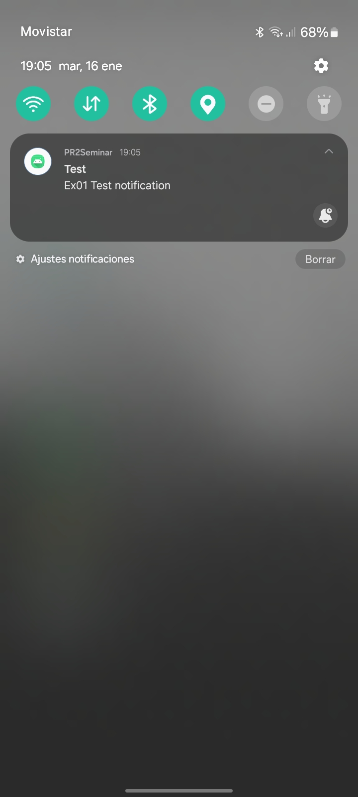
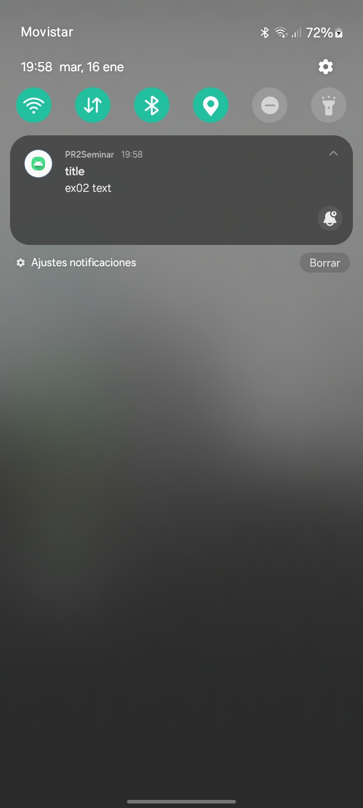
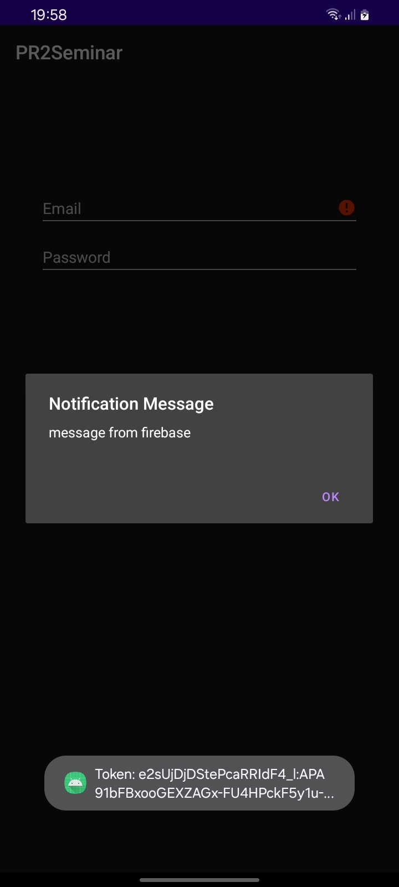
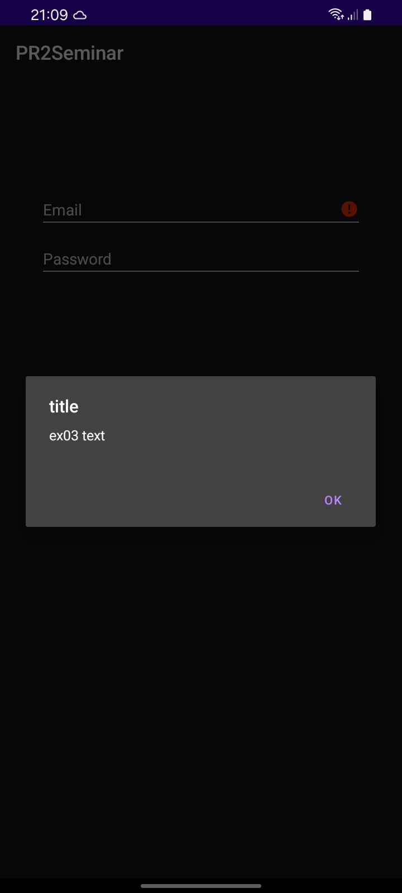
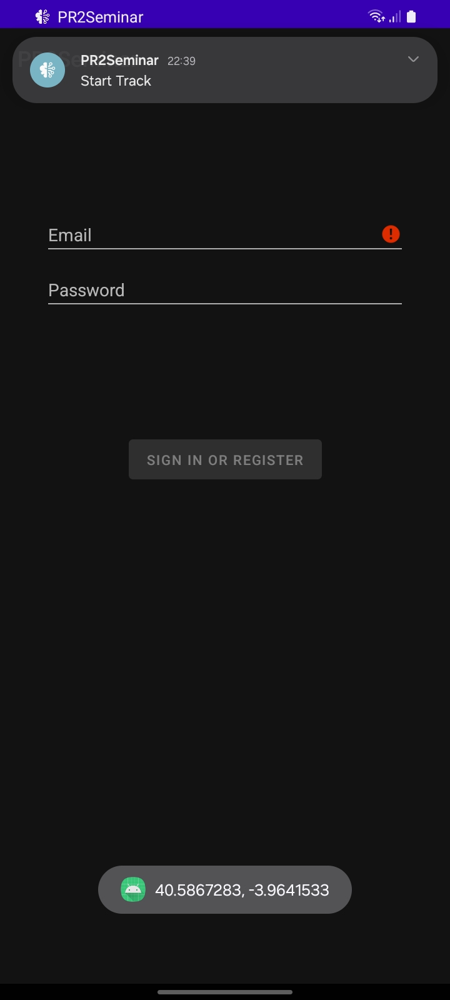

# CAT 5
Alejandro Pérez Bueno
Jan 16, 2024

-   [Exercise 1](#exercise-1)
-   [Exercise 2](#exercise-2)
-   [Exercise 3](#exercise-3)
-   [Exercise 4](#exercise-4)
-   [Annexes](#annexes)



## Exercise 1

In this exercise we had to enable Firebase Cloud Messaging and integrate
it on our app. To do this we had to do the following:

1.  Obtain the token.
2.  Create the notification.
3.  Send it to the phone using the obtained token.
4.  Receive it on the device while the app is in the background.

See [Figure 1](#fig-ex1) to see how the notification appears on the end
device

> **Tip**
>
> For this CAT I used a real phone connected through *ADB*, as it was
> more convenient than using an Android VM.

> **Note**
>
> Answered in Project Folder (see
> [`MainActivity.kt`](./PR5/app/src/main/java/com/uoc/pr2/MainActivity.kt)).

## Exercise 2

In the second exercise we had to extend the previous integration and
also load an alert upon clicking the notification.

See [Figure 2](#fig-ex2) for details on how the notification arrives,
and how the alert looks upon clicking on the notification.

> **Note**
>
> Answered in Project Folder (see
> [`MainActivity.kt`](./PR5/app/src/main/java/com/uoc/pr2/MainActivity.kt)).

## Exercise 3

For this one, we had to override the default `onMessageReceived`
function to implement a new alert, this time it will receive remote
notifications when the app is open, but will display them as an alert
instead of as a notification.

Check [Figure 3](#fig-ex3) to see an alert in action.

> **Note**
>
> Answered in Project Folder (see
> [`MainActivity.kt`](./PR5/app/src/main/java/com/uoc/pr2/MainActivity.kt)
> and
> [`MyFirebaseMessagingService.kt`](./PR5/app/src/main/java/com/uoc/pr2/MyFirebaseMessagingService.kt)).

## Exercise 4

The last exercise implements basic geolocation support in our app. To
implement it, we followed the following logic:

1.  Check if the location permission has been granted, if not request
    the user to grant it.
2.  Attempt to determine a location using on Google Play Services.
3.  Once a location is found, a toast message appears with the format
    “`latitude, longitude`” and a pop-up (also called heads-up)
    notification appears with the text “`Start Track`”.

Check [Figure 4](#fig-ex4) for more details.

> **Note**
>
> Answered in Project Folder (see
> [`MainActivity.kt`](./PR5/app/src/main/java/com/uoc/pr2/MainActivity.kt)).



## Annexes

<table>
<colgroup>
<col style="width: 50%" />
<col style="width: 50%" />
</colgroup>
<tbody>
<tr class="odd">
<td style="text-align: center;">

</td>
<td style="text-align: center;">

</td>
</tr>
</tbody>
</table>

Figure 2: Test alert upon opening notification

